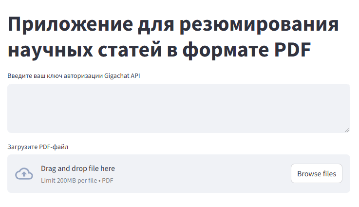
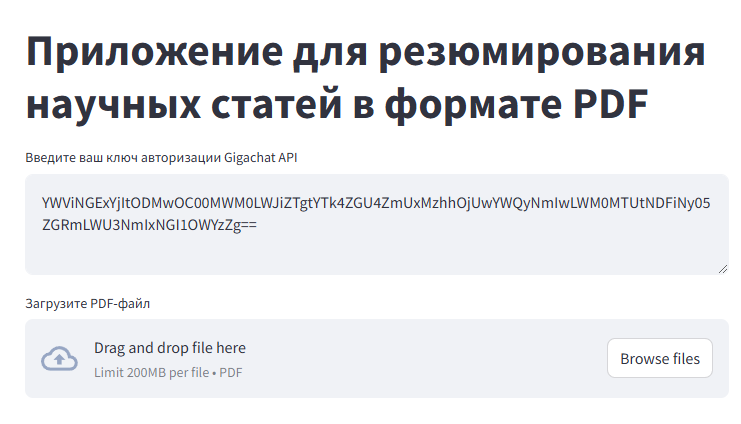
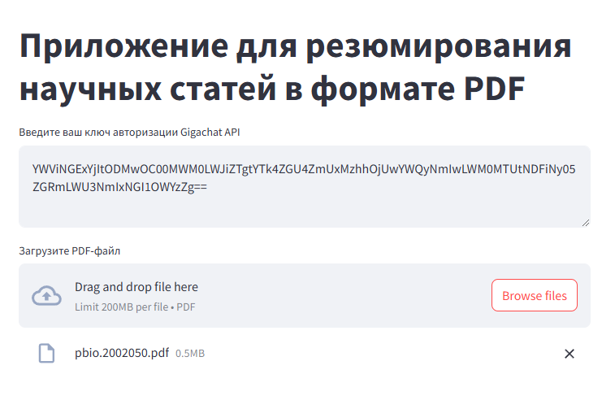
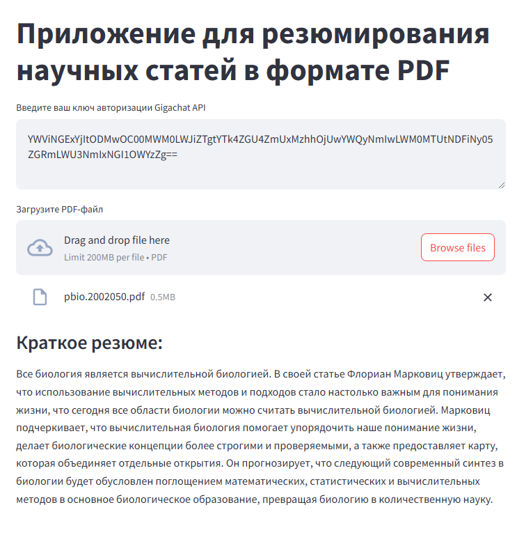

# Задание второго тура
## О репозитории
Репозиторий содержит блокнот Jupyter (1-3 пункт), web-приложение (4 пункт), README.md (5 пункт) и requirements.txt (6 пункт)
## Приложение для резюмирования статей
### О приложение
Это Web-приложение позволяет пользователям загружать PDF-файлы и получать краткие резюме статей благодаря GigaChat API. Цель проекта — упростить процесс извлечения ключевой информации из длинных документов, что позволяет быстро усваивать основные моменты.
### Используемые технологии
- [Документация streamlit](https://docs.streamlit.io/)
- [Документация PyMuPDF](https://pymupdf.readthedocs.io/en/latest/)
- [Документация GigaChat API](https://developers.sber.ru/docs/ru/gigachat/api/overview)
- [Документация GigaChain](https://developers.sber.ru/docs/ru/gigachain/overview)
- [Документация LangChain](https://python.langchain.com/docs/introduction/)

### Начало работы
Ниже приведена инструкция по началу работы. Чтобы получить локальную копию и запустить её, выполните следующие простые шаги.
#### Установка
1. Клонируйте репозиторий:
   ```bash
   git clone https://github.com/Aptukov/Task_of_the_second_tour
   ```
2. Установите необходимые пакеты:
   ```bash
   pip install -r requirements.txt
   ```
### Использование
1. Запустите приложение через терминал:
   ```bash
   streamlit run app.py
   ```
   Перед вами появится окно web-приложение:
   
2. Введите свой ключ авторизации:
   
3. Загрузите PDF-файл через интерфейс.
   
4. Получите резюме, которое отобразится спустя пару секунд после загрузки файла у вас на экране.
   
### Участие
Вклады — это то, что делает сообщество с открытым исходным кодом таким замечательным местом для обучения, вдохновения и творчества. Любой ваш вклад будет высоко оценен .

Если у вас есть предложение, которое сделает это лучше, пожалуйста, разветвите репозиторий и создайте запрос на извлечение. Вы также можете просто открыть проблему с тегом "улучшение". Не забудьте поставить проекту звезду! Спасибо еще раз!
## Контакты

Аптуков Вадим - [Аккаунт в телеграме](@HackNet11) - vraptukov@gmail.com

Ссылка на проект: [https://github.com/Aptukov/Task_of_the_second_tour](https://github.com/Aptukov/Task_of_the_second_tour)
